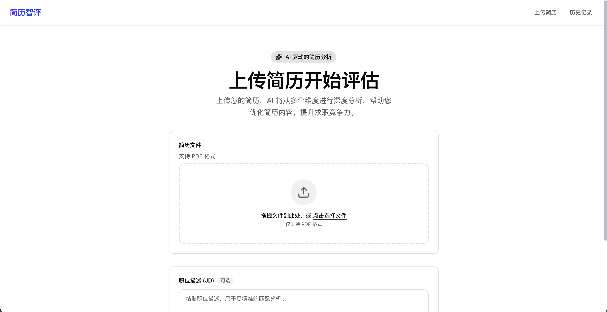
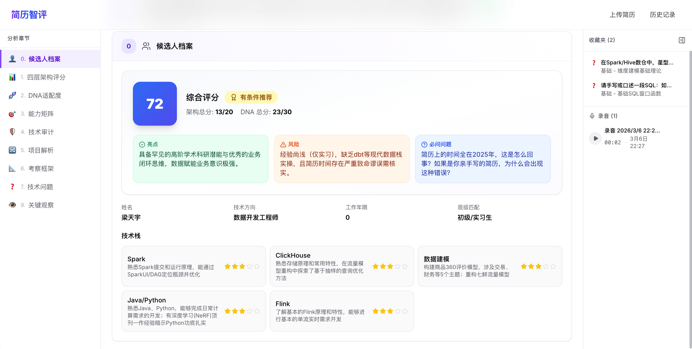
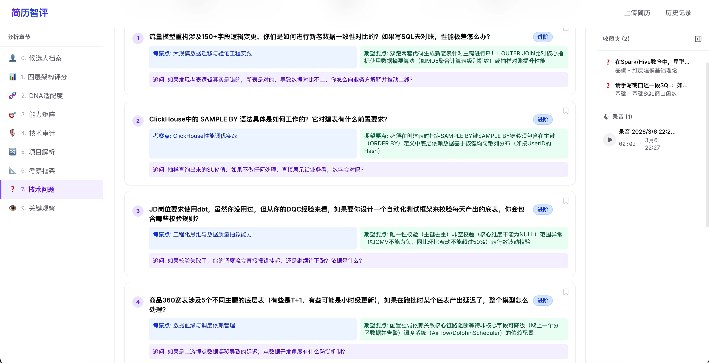
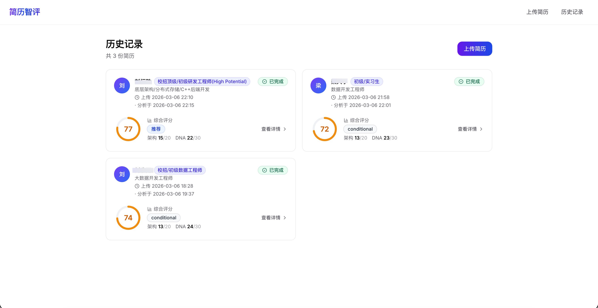
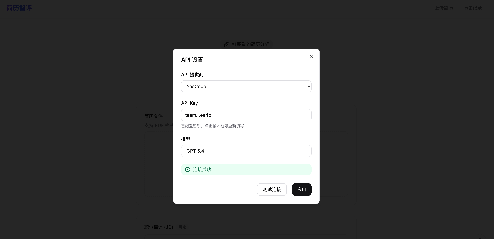

# iResume — AI 简历智评

> 上传简历 PDF，AI 自动生成深度面试评估报告，帮助面试官快速洞察候选人真实实力。

基于 **"DNA × 四层架构"评估框架**，从技术能力、项目经验、文化匹配度等多维度对候选人进行全方位剖析，自动生成结构化面试指南。



---

## 核心功能

**10 大分析模块** — 一份简历，十个维度，全面透视候选人：

| 模块 | 说明 |
|------|------|
| 候选人画像 | 技术方向、经验年限、技术栈熟练度评估 |
| 四层架构评分 | UI 层 / Algorithm 层 / 算力层 / 经验层，0-5 分精准量化 |
| DNA 文化匹配 | 追求极致、相信技术、数据说话等 6 个维度 |
| 能力矩阵 | 自动匹配 JD 要求，标记匹配度与验证优先级 |
| 声明审计 | 反注水核查，自动识别模糊量化、角色不匹配等可疑信号 |
| 项目深度分析 | 逐个项目拆解，含矛盾点分析和面试决策树 |
| 评估框架 | 权重分配、核心优势与风险、优先验证点 |
| 技术问题库 | 20 道分级技术题（基础 / 进阶 / 专家），紧贴候选人技术栈 |
| 算法题库 | 9 道分级算法题（简单 / 中等 / 困难），含测试样例 |
| 综合评分卡 | 最终评分 0-100 + 录用建议（强烈推荐 / 推荐 / 待定 / 不推荐） |



### 更多亮点

- **实时流式分析** — SSE 流式输出，分析过程实时可见
- **后台分析** — 分析过程中可自由浏览其他简历记录，分析在服务端后台继续执行，完成后自动保存
- **JD 智能匹配** — 可选上传岗位 JD，自动逐项匹配能力要求
- **收藏夹** — 一键收藏关键问题和分析要点，面试时快速回顾
- **面试录音** — 内置麦克风录音功能，录音自动挂载到对应简历（注：受浏览器安全限制，仅支持麦克风录音，不支持录制电脑系统声音）
- **历史记录** — 所有分析报告持久化存储，随时回看





---

## 快速开始

### 环境要求

- **Node.js** 18+（推荐 20+）
- **npm**（随 Node.js 一起安装）
- 一个 **AiHubMix** 或 **DeerAPI** 的 API Key

### 第一步：获取 API Key

本项目支持以下 API 渠道（均兼容 OpenAI 协议），任选其一：

| 渠道 | 地址 | 说明 |
|------|------|------|
| **AiHubMix** | [aihubmix.com](https://aihubmix.com) | 默认渠道 |
| **DeerAPI** (小鹿API) | [deerapi.com](https://www.deerapi.com) | 国内友好 |

注册账号后，在控制台创建 API Key（以 `sk-` 开头），保存好后面要用。

**支持的模型：**
| 模型 | 说明 |
|------|------|
| `gemini-3.1-pro-preview` | Google Gemini（默认，性价比高） |
| `claude-sonnet-4-5` | Anthropic Claude |
| `gpt-5.4` | OpenAI GPT |
| `gemini-3.1-flash-lite-preview` | Google Gemini Flash Lite（速度快） |
| `qwen3.5-27b` | 通义千问（速度快） |
| `deepseek-v3.2` | DeepSeek V3.2（速度快） |

> **想使用其他 API 提供商？** 本项目内置 AiHubMix 和 DeerAPI 支持。如需接入其他提供商（如 OpenRouter、自建代理等），可自行修改 `src/lib/openai.ts` 中的 `PROVIDER_BASE_URLS` 和相关逻辑，只要兼容 OpenAI API 协议即可。

### 第二步：克隆项目

```bash
git clone git@github.com:Becoues/iResume.git
cd iResume
```

### 第三步：安装依赖

```bash
npm install
```

这一步会自动安装所有依赖并生成 Prisma 客户端。

### 第四步：配置环境变量

```bash
cp .env.example .env.local
```

`.env.local` 中包含数据库路径和 API Key 配置，**必须创建此文件**，否则项目无法连接数据库：

```env
# 数据库路径（必填，默认即可）
DATABASE_URL="file:./prisma/dev.db"

# API Key（可选，也可以在界面中配置）
AIHUBMIX_API_KEY=sk-你的Key粘贴到这里
```

> 如果不需要通过环境变量配置 API Key，也**必须保留 `DATABASE_URL` 这一行**。

#### API Key 配置（可选）

启动项目后，点击页面右下角的 **齿轮按钮**，在设置面板中：

1. 选择 **API 渠道**（AiHubMix 或 DeerAPI）
2. 填写 **API Key**（对应渠道的 `sk-` 开头的 Key）
3. 选择 **模型**
4. 点击 **测试连接** 验证配置是否正确
5. 点击 **应用** 保存



> 界面配置的优先级高于环境变量。配置保存在本地数据库中，重启后依然有效。已保存的 Key 仅显示首尾 4 位。切换渠道时会自动显示该渠道上次保存的 Key。

### 第五步：初始化数据库

```bash
npx prisma db push
```

自动创建 SQLite 数据库文件，无需安装任何数据库软件。

### 第六步：启动项目

```bash
npm run dev
```

看到以下输出就说明启动成功了：

```
▲ Next.js 14.x.x
- Local:    http://localhost:3000
```

打开浏览器访问 **http://localhost:3000**，开始使用！

---

## Docker 部署

如果你不想安装 Node.js，可以用 Docker 一键启动：

### 环境要求

- **Docker** 20+（推荐最新版）
- **Docker Compose** V2+（Docker Desktop 已内置）

> **国内用户注意：** 如果拉取镜像超时，请在 Docker Desktop 的 **Settings → Docker Engine** 中添加镜像加速器：
> ```json
> "registry-mirrors": ["https://docker.1ms.run", "https://docker.m.daocloud.io"]
> ```

### 方式 A：Docker Compose（推荐）

```bash
git clone git@github.com:Becoues/iResume.git
cd iResume
docker compose build
docker run -d --name iresume -p 3000:3000 -v ./prisma:/app/prisma resume-analyzer-iresume:latest
```

### 方式 B：手动构建

```bash
docker build -t iresume .
docker run -d --name iresume -p 3000:3000 -v ./prisma:/app/prisma iresume
```

启动后访问 **http://localhost:3000**，在页面齿轮按钮中配置 API Key 即可。

> 数据（简历、录音、API 设置）存储在本地 `prisma/dev.db` 中，Docker 与本地开发共享同一数据库。
>
> **注意：不要同时运行 Docker 和 `npm run dev`，SQLite 不支持多进程并发写入，会导致锁冲突。**

---

## 使用方法

1. **上传简历** — 在首页拖拽或点击上传 PDF 格式的简历
2. **填写 JD**（可选） — 粘贴岗位描述，AI 会自动匹配能力要求
3. **开始分析** — 点击分析按钮，实时观看 AI 生成评估报告
4. **查看报告** — 左侧导航切换 10 个分析模块，右侧面板管理收藏
5. **收藏要点** — 点击星标收藏关键问题和分析条目
6. **录制面试** — 点击右上角麦克风按钮录制面试音频
7. **历史回顾** — 顶部导航栏进入历史记录，查看所有分析报告

---

## 技术栈

| 技术 | 说明 |
|------|------|
| [Next.js 14](https://nextjs.org) | React 全栈框架（App Router） |
| [Tailwind CSS 3](https://tailwindcss.com) | 原子化 CSS 样式 |
| [Prisma 5](https://www.prisma.io) | 数据库 ORM |
| [SQLite](https://www.sqlite.org) | 轻量级本地数据库，零配置 |
| [OpenAI SDK](https://github.com/openai/openai-node) | LLM 接口调用（支持 AiHubMix / DeerAPI 多渠道） |
| [pdfjs-dist](https://github.com/nickolasg/pdfjs-dist) | PDF 文本提取 |
| [Recharts](https://recharts.org) | 雷达图等数据可视化 |
| [Lucide React](https://lucide.dev) | 图标库 |

---

## 项目结构

```
resume-analyzer/
├── prisma/
│   └── schema.prisma           # 数据库模型（Resume, Recording, Settings）
├── docs/images/                # 文档截图
├── src/
│   ├── app/
│   │   ├── page.tsx            # 首页（上传 + 设置入口）
│   │   ├── layout.tsx          # 全局布局（顶部导航）
│   │   ├── resumes/
│   │   │   ├── page.tsx        # 历史记录列表
│   │   │   └── [id]/page.tsx   # 分析详情页（10 模块）
│   │   └── api/
│   │       ├── resumes/        # 简历 CRUD + 录音管理
│   │       ├── analyze/[id]/   # LLM 流式分析（SSE）
│   │       └── settings/       # API 设置 + 连接测试
│   ├── components/
│   │   ├── settings-dialog.tsx # 设置弹窗组件
│   │   └── ui/                 # shadcn 风格 UI 组件
│   └── lib/
│       ├── openai.ts           # OpenAI SDK 客户端（多渠道支持）
│       ├── prompt.ts           # DNA × 四层架构评估 Prompt
│       ├── score-utils.ts      # 分数后处理与分布拉伸
│       ├── types.ts            # ResumeAnalysis 类型定义
│       ├── pdf.ts              # PDF 文本提取
│       └── db.ts               # Prisma 单例
├── .env.example                # 环境变量模板
└── package.json
```

---

## 自定义 API 提供商

内置 AiHubMix 和 DeerAPI 两个渠道。如需新增其他 OpenAI 兼容的 API 提供商，在 `src/lib/openai.ts` 的 `PROVIDER_BASE_URLS` 中添加映射即可：

```typescript
const PROVIDER_BASE_URLS: Record<string, string> = {
  AiHubMix: "https://aihubmix.com/v1",
  DeerAPI: "https://api.deerapi.com/v1",
  // 新增你的渠道：
  MyProvider: "https://your-api-provider.com/v1",
};
```

同时在 `src/components/settings-dialog.tsx` 的 `PROVIDERS` 数组中添加对应的选项。只要目标服务兼容 OpenAI Chat Completions API（`/v1/chat/completions`），即可无缝接入。

---

## 常见问题

### Q: 分析速度比较慢？

单份简历的完整分析（10 个模块）大约需要 **5-10 分钟**（以 `gemini-3.1-pro-preview` 为例），取决于简历长度和模型响应速度。分析支持后台执行——你可以在分析过程中自由浏览其他简历记录，分析完成后结果会自动保存。

### Q: 测试连接失败？

- 检查 Key 是否以 `sk-` 开头
- 确认 AiHubMix 账户余额充足
- 确保网络可以访问 `https://aihubmix.com`

### Q: 支持哪些格式的简历？

目前仅支持 **PDF** 格式。建议上传文本型 PDF（非扫描件），以获得最佳文本提取效果。

### Q: 数据存在哪里？安全吗？

所有数据存储在本地 SQLite 数据库（`prisma/dev.db`），不会上传到任何外部服务器。简历内容仅在分析时发送给 AI 接口。API Key 在界面中仅显示首尾 4 位。

### Q: 录音能录制电脑系统声音吗？

不能。录音功能基于浏览器 `MediaRecorder` API，受安全策略限制**仅支持麦克风输入**。如需录制电脑内部音频（如扬声器输出），需借助系统级虚拟音频工具（如 macOS 的 BlackHole、Windows 的 VB-Cable）将系统音频路由到虚拟麦克风，再由本应用录制。

### Q: 想接入其他 API 提供商？

本项目内置 [AiHubMix](https://aihubmix.com) 和 [DeerAPI](https://www.deerapi.com) 支持。如需接入其他提供商（OpenRouter、自建代理等），修改 `src/lib/openai.ts` 中的 `PROVIDER_BASE_URLS` 映射即可，只要兼容 OpenAI Chat Completions API（`/v1/chat/completions`）协议。你也可以直接让 AI 帮你改这个文件。

---

## License

MIT
